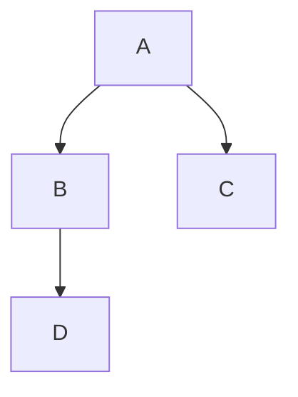

<!-- START doctoc generated TOC please keep comment here to allow auto update -->
<!-- DON'T EDIT THIS SECTION, INSTEAD RE-RUN doctoc TO UPDATE -->

- [Heading 1](#heading-1)
  - [Heading 2](#heading-2)
    - [Heading 3](#heading-3)
      - [Heading 4](#heading-4)
        - [Heading 5](#heading-5)
          - [Heading 6](#heading-6)
- [This Section is maybe page 2](#this-section-is-maybe-page-2)
- [This section is page 3](#this-section-is-page-3)

<!-- END doctoc generated TOC please keep comment here to allow auto update -->

# Heading 1
- Supports mermaid



Also, you can use code block.

```go
package main

func main() {
	fmt.Println("Hello World")
}
```

## Heading 2
- Supports textlint
  - これは ペン です。
  - javascript

### Heading 3
- Supports emoji
  - :fire:

#### Heading 4
- Hello World

##### Heading 5
- Hello World

###### Heading 6
- Hello World

# This Section is maybe page 2

<div class="page-break"></div>

# This section is page 3
- Hi, I'm bmf-san.